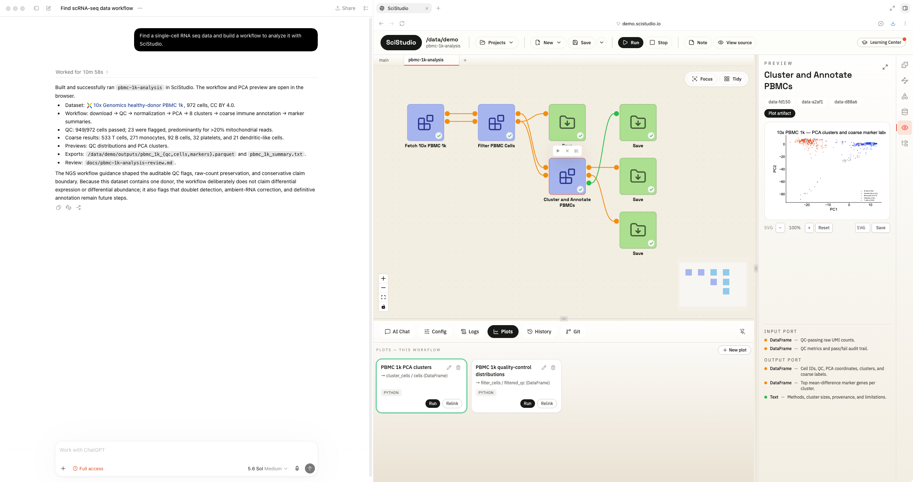

<div align="center">

# SciStudio-web

**Scientific data workbench with your AI partner.**



SciStudio-web is an interactive workflow orchestration system for multimodal
scientific data analysis. You and your agent partner work together through
WebMCP tools, building a new era of science.

[](LICENSE)
[](https://www.python.org/downloads/)
[](https://github.com/webmachinelearning/webmcp)

</div>

---

This repository is SciStudio's entry for the
[WebMCP Challenge](https://webmcp.devpost.com/) — a hardened redeploy of the
original [SciStudio](https://github.com/jiazhenz026/SciStudio), newly
integrating:

1. A refactor of the original self-contained MCP server into WebMCP.
2. Docker deployment.
3. An optimized web-frontend layout and user experience for use inside ChatGPT.
4. A packaged demo case.

Try it live at **[demo.scistudio.io](https://demo.scistudio.io)** — open only to
judges holding an access code (I can't afford to run it open to everyone). If
you really want to use SciStudio, download the
[desktop app](https://github.com/jiazhenz026/SciStudio/releases).

## Running it

**In ChatGPT.** Open [demo.scistudio.io](https://demo.scistudio.io) in the
ChatGPT desktop app's built-in browser (site tools are on for GPT-5.6 Sol /
Terra), enter your access code, and ask your agent partner to get started. It
also works in **Chrome 149+** with `chrome://flags/#enable-webmcp-testing`
enabled and the browser relaunched.

**Deploying your own.** The demo runs as a Cloudflare Worker in front of one
container per session. The Worker checks the password and hands each
authenticated browser its own isolated SciStudio container; an unauthenticated
request never starts one, so the URL cannot be used to spin up compute.

```bash
npm install
npx wrangler secret put DEMO_PASSWORD   # the access code you hand to judges
npx wrangler deploy                     # builds the Dockerfile, pushes the image, rolls out
```

The container image is a two-stage Docker build (the SPA under Node, the runtime
under Python) and runs as non-root with the project directory as its only
writable path. To run it directly, without Cloudflare:

```bash
docker build -t scistudio-web .
docker run -p 8000:8000 \
  -e SCISTUDIO_PUBLIC_DEMO=1 \
  -e SCISTUDIO_DEMO_PASSWORD=your-access-code \
  scistudio-web
```

## How the WebMCP integration works

SciStudio already exposes its capabilities as an MCP tool server for local
agents over a socket. A browser agent cannot reach that socket, so this repo
bridges the **same** tool catalogue over HTTP and registers it in the page:

```
ChatGPT / Chrome agent
        │  document.modelContext.registerTool(...)     ← the SPA (src/scistudio/api/static)
        ▼
  GET  /api/webmcp/tools   ─┐
  POST /api/webmcp/call     ├─ src/scistudio/api/routes/webmcp.py
        │                   ┘
        ▼
  the same FastMCP instance the local socket transport serves
        │
        ▼
  SciStudio workflow runtime
```

- **`src/scistudio/api/routes/webmcp.py`** — lists the catalogue and forwards
  each call to the one FastMCP instance, so a tool added to the Python server
  appears in the browser with no frontend change and the two surfaces cannot
  drift. It also synthesises the few tools a *browser* agent needs that a local
  CLI agent gets from its shell: `about_scistudio` (the authoritative product
  description, which routes the agent to the contract pages it must read before
  authoring blocks, plots, or workflow YAML), `import_data`, `read_file`,
  `write_file`, and `run_bash`.
- **`frontend/src/webmcp/`** — fetches that catalogue and calls `registerTool()`
  for each entry. It probes both `document.modelContext` (Chrome 150+, ChatGPT
  desktop) and `navigator.modelContext` (Chrome 149), since both are live in the
  origin trial.

## Public-deployment hardening

SciStudio is a local-first runtime that executes user code by design — that is
the point of the demo, an agent authoring and running a real analysis block. On
a public URL, several layers keep that capability bounded:

- **A password gate** — the Cloudflare Worker gates the URL, and
  `src/scistudio/api/demo_auth.py` gates the app itself as pure ASGI, so it
  covers the `/ws` WebSocket, not only the REST surface. The app refuses to
  start without `SCISTUDIO_DEMO_PASSWORD`, so a misconfigured deploy fails
  closed.
- **The container is the boundary** — one per session, non-root, the installed
  wheel with its source tree deleted, and an environment holding no credentials
  beyond the low-value demo password.
- **One router withheld** (`src/scistudio/public_demo.py`) — the package
  installer, which would mutate the running interpreter. Everything the demo
  actually exercises — writing blocks, running workflows, executing
  agent-authored code — stays live behind the password.

## Acknowledgements

SciStudio-web stands on a lot of open source. Thank you to the maintainers of:

**The WebMCP integration**
- [WebMCP](https://github.com/webmachinelearning/webmcp) — the browser
  tool-registration API this entry is built around
- [FastMCP](https://github.com/jlowin/fastmcp) — the MCP server the tool
  catalogue is served from

**Backend & runtime**
- [FastAPI](https://fastapi.tiangolo.com/), [Starlette](https://www.starlette.io/),
  [Uvicorn](https://www.uvicorn.org/), [Pydantic](https://docs.pydantic.dev/) —
  the API layer
- [NumPy](https://numpy.org/), [pandas](https://pandas.pydata.org/),
  [Zarr](https://zarr.dev/), [PyArrow](https://arrow.apache.org/),
  [matplotlib](https://matplotlib.org/) — the scientific data & plotting stack
- [Typer](https://typer.tiangolo.com/), [PyYAML](https://pyyaml.org/) /
  [ruamel.yaml](https://yaml.readthedocs.io/),
  [watchdog](https://github.com/gorakhargosh/watchdog),
  [xxhash](https://github.com/ifduyue/python-xxhash)

**Frontend**
- [React](https://react.dev/) + [Vite](https://vite.dev/),
  [Zustand](https://zustand-demo.pmnd.rs/)
- [React Flow](https://reactflow.dev/) (`@xyflow/react`) — the workflow canvas
- [Monaco Editor](https://microsoft.github.io/monaco-editor/) — the code editor
- [Plotly.js](https://plotly.com/javascript/) — interactive plots
- [xterm.js](https://xtermjs.org/) — the embedded terminal
- [Radix UI](https://www.radix-ui.com/), [Tailwind CSS](https://tailwindcss.com/),
  [Lucide](https://lucide.dev/)

**Infrastructure**
- [Cloudflare Workers & Containers](https://developers.cloudflare.com/containers/)
  — the demo's front door and per-session isolation

## License

Apache License 2.0. See [LICENSE](LICENSE). SciStudio-web is a redeploy of
[SciStudio](https://github.com/jiazhenz026/SciStudio).
